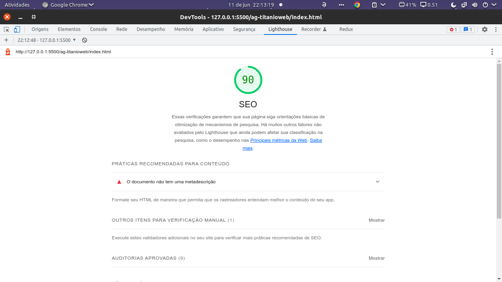

# Projeto teste para Agência Titânio

Projeto para criação de uma página web seguindo 
um protótipo do figma já criado pelo design.

- [x] Projeto com as medidas com o máximo de fidelidade com o figma.
---
- [x] Versão para tela de 1500px.
---
- [x] Responsivo até a 
tela chegar ao tamanho de 1026px(1115px).
---
- [x] Versão responsiva para telas menores que 1115px.
---
- [ ] Versão responsiva para telas menores que 885px.
#### Relatório de SEO da página

[**Link para o repositório.**](https://github.com/Igor-Alex-Castro/ag-titanioweb)